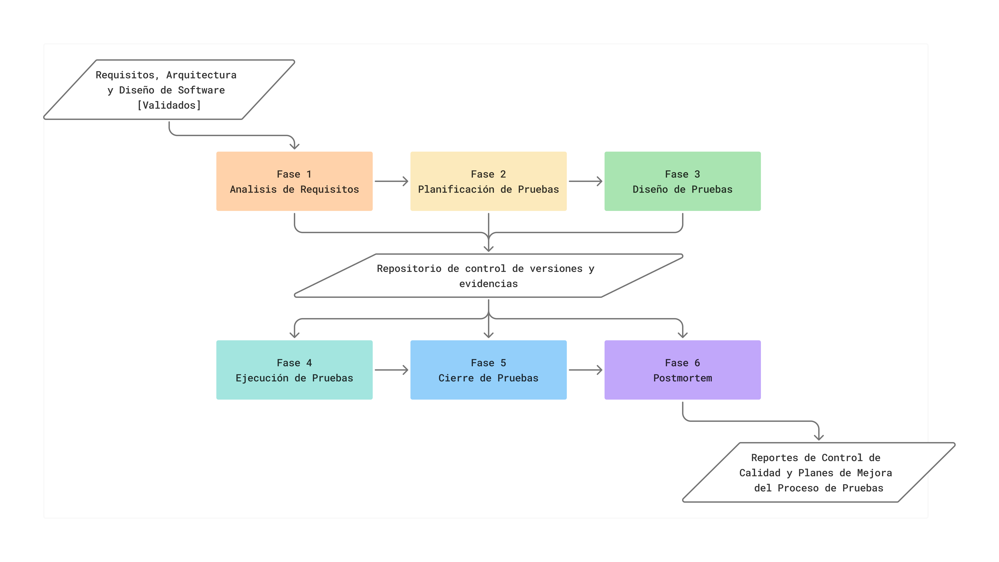

Visión General
=============

El proceso de pruebas de software es una etapa crítica dentro del ciclo de vida del desarrollo, especialmente en sistemas embebidos de misión crítica como los que operan en CubeSats. Tradicionalmente, el Software Testing Life Cycle (STLC) proporciona una estructura secuencial y disciplinada que permite planificar, diseñar, ejecutar y cerrar pruebas de forma sistemática, asegurando la calidad del producto final.

Proceso de pruebas tradicional en el ciclo STLC
-----------------------------------------------

El STLC contempla cinco fases principales:

1. **Análisis de requisitos**
2. **Planificación de pruebas**
3. **Diseño de pruebas**
4. **Ejecución de pruebas**
5. **Cierre de pruebas**

Cada fase genera productos de trabajo específicos y requiere la participación de roles técnicos. Este modelo ha sido ampliamente adoptado en entornos industriales por su claridad y enfoque en la trazabilidad y el aseguramiento de calidad.

En particular, el modelo STLC utilizado por la NASA para el desarrollo de software en misiones aeroespaciales se destaca por su formalidad, segmentación en etapas (Planning, Defining, Development, Implementation, Maintenance) y su aplicación en proyectos donde la confiabilidad y la verificación son esenciales. Este modelo se alinea con el enfoque para software crítico.

Motivación para adaptarlo a entornos CubeSat
--------------------------------------------

Aunque los CubeSats comparten muchas de las exigencias de misiones espaciales mayores, como operar en condiciones adversas (radiación, vacío térmico, latencias de comunicación), sus procesos de desarrollo suelen darse en contextos muy distintos:

- Equipos más pequeños y multidisciplinarios
- Recursos limitados (tiempo, herramientas, personal)
- Desarrollo vinculado a instituciones educativas o centros de investigación

Esto hace que la aplicación directa del modelo STLC de la NASA sea difícil sin una adaptación previa. Las actividades y entregables deben adecuarse a la escala y contexto de estas misiones, sin perder el rigor que exige la validación de sistemas para el espacio.

Brecha identificada y oportunidad de mejora
-------------------------------------------

Durante el análisis de los modelos actuales (NASA-STLC, ISO/IEC 29110, CMMI, TMMi), se identificó una brecha entre la formalidad requerida para garantizar calidad en software espacial y la capacidad real de los equipos que desarrollan CubeSats - especialmente en México - para implementar procesos de prueba estandarizados, trazables y sostenibles.

Por ello, esta guía propone una versión adaptada e integrada del STLC, que conserve los principios esenciales de verificación y validación, pero los reorganice y complemente según:

- Las restricciones típicas de un equipo de nanosatélite
- Las prácticas que sí se han implementado exitosamente
- Las actividades que pueden automatizarse, simplificarse o priorizarse

Estructura general de la propuesta
----------------------------------

La propuesta consiste en un subproceso de pruebas compuesto por **6 fases estructuradas**, más una **fase adicional postmortem**, diseñada para capturar retroalimentación, evaluar el proceso completo y consolidar lecciones aprendidas.

Las fases son:

1. **Análisis de Requisitos**
2. **Planificación de Pruebas**
3. **Diseño de Pruebas**
4. **Ejecución de Pruebas**
5. **Cierre de Pruebas**
6. **Postmortem**

Todas las fases están integradas con un componente de soporte transversal basado en un repositorio de proyecto con control de versiones, que permite mantener trazabilidad, gestionar productos de trabajo, evidencias y métricas del proceso.

Cada fase incluye:

- Actividades específicas
- Productos de entrada y salida definidos
- Roles involucrados
- Herramientas sugeridas
- Estados del producto de trabajo

Representación general del modelo propuesto
-------------------------------------------
A continuación, se presenta un diagrama general del subproceso de pruebas adaptado al contexto CubeSat. Este esquema resume la secuencia lógica de las seis fases principales y la fase propuesta postmortem, incluyendo además el soporte transversal brindado por el repositorio de versiones y evidencias.

Se muestran también los productos de entrada más representativos - requisitos, arquitectura y diseño validados - y los productos de salida más significativos, como los reportes de control de calidad y los planes de mejora del proceso de pruebas, generados tras el cierre y análisis post-ejecución.

   Figura 1. Diagrama general del subproceso de pruebas propuesto