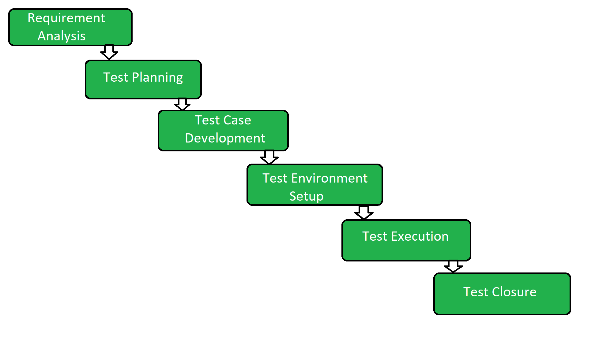

# STLC

El Software Testing Life Cycle (STLC) es un modelo estructurado que define las etapas por las cuales pasa el proceso de pruebas de software desde su planeación hasta su cierre formal. Cada etapa genera productos de trabajo específicos y busca asegurar la calidad del sistema en función de requisitos previamente definidos.

## Etapas clásicas del STLC

El ciclo tradicional del STLC comprende las siguientes fases secuenciales:

1. **Análisis de requisitos**: Evaluación detallada de los requisitos del sistema para identificar qué aspectos serán objeto de prueba. Incluye la detección de pruebas funcionales, no funcionales, y criterios de aceptación.

2. **Planificación de pruebas**: Definición del alcance de las pruebas, estrategia, recursos, estimaciones de tiempo y herramientas necesarias. Se establecen los entregables esperados, roles responsables y riesgos identificados.

3. **Diseño de pruebas**: Elaboración de los casos de prueba, diseño de datos de entrada, matrices de trazabilidad y procedimientos de ejecución. Esta fase asegura la cobertura de todos los requisitos.

4. **Ejecución de pruebas**: Implementación real de los casos de prueba definidos. Se documentan los resultados, se gestionan los defectos encontrados y se asegura la trazabilidad con los requisitos.

5. **Cierre de pruebas**: Revisión de resultados finales, reporte de cumplimiento de objetivos, documentación de hallazgos, lecciones aprendidas y aprobación formal del subproceso.

   Figura 1. Diagrama general del STLC

## Relación con otros procesos del ciclo de vida

El subproceso de pruebas propuesto en esta guía forma parte integral del proceso de Implementación de Software (IS). Su ejecución se basa en productos de entrada generados por las fases previas del desarrollo, como los requisitos validados, el diseño aprobado y los ambientes de prueba definidos.

## Condiciones de entrada al subproceso de pruebas

Para aplicar esta guía, se requiere que el proyecto cuente con los siguientes elementos básicos previos a la ejecución del subproceso de pruebas:

- Requisitos del software documentados y validados
- Diseño de software aprobado (a nivel de arquitectura y componentes)
- Plan de proyecto establecido y aceptado por las partes interesadas
- Equipo de desarrollo y pruebas asignado y con capacidades técnicas suficientes
- Acceso al entorno de pruebas (físico, virtual o simulado)
- Herramientas básicas de registro y control de pruebas

## Soporte transversal: repositorio de trabajo y control de versiones

Como soporte complementario, esta guía considera el uso de un repositorio de proyecto para almacenar y versionar los productos de trabajo generados durante las actividades de pruebas. Esto incluye:

- Casos de prueba, datos de prueba y procedimientos
- Reportes de ejecución, incidencias y métricas
- Versiones del software bajo prueba
- Evidencia de validación y aceptación

Este repositorio deberá gestionarse mediante una estrategia de control de versiones previamente documentada. Su implementación es clave para garantizar la trazabilidad, integridad y disponibilidad de la información durante todo el ciclo de vida del proyecto.